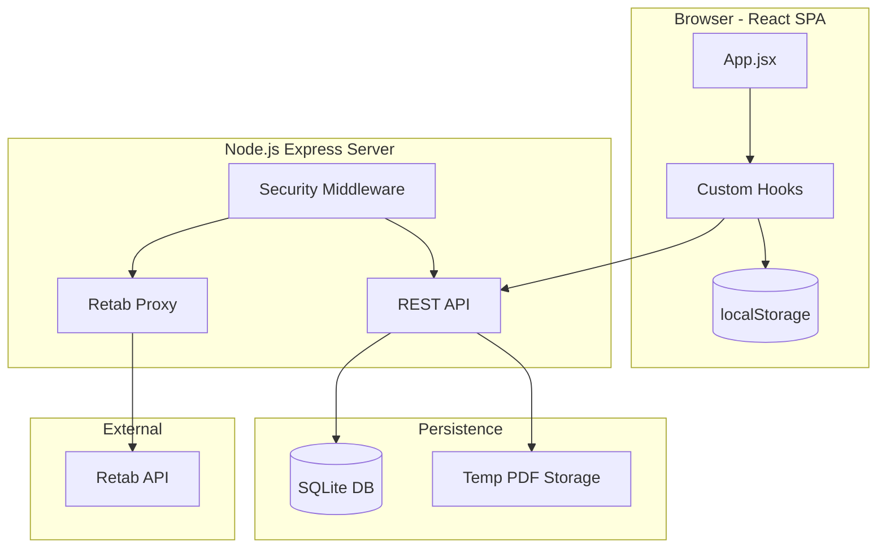

# CORTEX Architecture Documentation Update

## Overview

This plan updates the Technical Reference documentation in `src/components/HelpDocumentation.jsx` and creates a comprehensive `docs/ARCHITECTURE.md` file with detailed engineering documentation.

---

## Current State Analysis

The existing Technical Reference section has significant gaps:

- Only documents Retab proxy endpoints (missing 25+ internal REST API endpoints)
- No database schema documentation
- Missing request/response examples
- Incomplete environment variable documentation
- No document lifecycle/state machine documentation

---

## Architecture Summary

---

## Deliverables

### 1. New Architecture Document (`docs/ARCHITECTURE.md`)

A comprehensive markdown document covering:

- **System Overview**: High-level architecture diagram and component descriptions
- **Data Flow**: Complete document processing pipeline with state diagrams
- **Database Schema**: All 6 tables with columns, indexes, and relationships
- **API Reference**: All 35+ endpoints organized by resource
- **State Machines**: Packet and document status transitions
- **Configuration**: All environment variables and localStorage keys
- **Security**: Middleware stack, rate limiting, authentication
- **Deployment**: Docker, production considerations

### 2. Updated Technical Reference (`src/components/HelpDocumentation.jsx`)

Update the `TechnicalReferenceContent` component with:

#### Architecture Overview (update existing)

- Update Mermaid diagram to show full data flow
- Add component descriptions with technology stack

#### API Reference Table (major expansion)

- Add Internal REST API section with all endpoints:
  - Sessions (6 endpoints)
  - Packets (8 endpoints)  
  - Documents (5 endpoints)
  - History (4 endpoints)
  - Admin (2 endpoints)
  - Export Templates (3 endpoints)
  - Usage/Stats (2 endpoints)
  - Health/Status (2 endpoints)
  - File Upload (2 endpoints)
- Fix path inconsistencies (include `/api` prefix)
- Add request body examples

#### Database Schema (new section)

- All 6 tables: sessions, packets, documents, history, usage_daily, export_templates
- Column definitions with types
- Index documentation
- Relationships (foreign keys)

#### Environment & Config (expand)

- Add `VITE_API_URL`
- Document all localStorage keys
- Add configuration defaults

#### Document Lifecycle (new section)

- Packet states: QUEUED → SPLITTING → EXTRACTING → COMPLETED/NEEDS_REVIEW/FAILED
- Document states: processing → completed/needs_review/failed
- Review workflow states

#### Rate Limiting (new section)

- General API: 120 req/min (prod) / 300 req/min (dev)
- Proxy endpoints: 60 req/min (prod) / 120 req/min (dev)

---

## Key Files to Modify

1. **[src/components/HelpDocumentation.jsx](src/components/HelpDocumentation.jsx)**
  - Update `ArchitectureOverview` function (~line 850)
  - Expand `APIReferenceTable` function (~line 889)
  - Expand `EnvAndConfig` function (~line 924)
  - Add new `DatabaseSchema` component
  - Add new `DocumentLifecycle` component
  - Add new `RateLimiting` section
  - Update `TechnicalReferenceContent` to include new sections
2. **[docs/ARCHITECTURE.md](docs/ARCHITECTURE.md)** (new file)
  - Comprehensive standalone documentation

---

## Data to Include

### Complete API Endpoint List (35 endpoints)

**Sessions:**

- `GET /api/sessions/active`
- `GET /api/sessions/:id`
- `POST /api/sessions`
- `PATCH /api/sessions/:id`
- `POST /api/sessions/:id/close`
- `GET /api/sessions/:id/full`

**Packets:**

- `POST /api/packets`
- `GET /api/packets/:id`
- `GET /api/sessions/:sessionId/packets`
- `PATCH /api/packets/:id`
- `POST /api/packets/:id/complete`
- `DELETE /api/packets/:id`
- `POST /api/upload`
- `GET /api/packets/:id/file`

**Documents:**

- `POST /api/documents`
- `GET /api/documents/:id`
- `GET /api/packets/:packetId/documents`
- `GET /api/sessions/:sessionId/review-queue`
- `POST /api/documents/:id/review`

**History:**

- `GET /api/history`
- `POST /api/history`
- `DELETE /api/history/:id`
- `DELETE /api/history`

**Admin:**

- `GET /api/admin/metrics`
- `POST /api/admin/clear-database`

**Export Templates:**

- `GET /api/export-templates`
- `POST /api/export-templates`
- `DELETE /api/export-templates/:name`

**Usage/Stats:**

- `GET /api/usage`
- `GET /api/stats/30d`

**Health:**

- `GET /health`
- `GET /api/status`

**Retab Proxy:**

- `POST /api/documents/split`
- `POST /api/documents/classify`
- `POST /api/documents/extract`
- `POST /api/documents/parse`
- `POST /api/schemas/generate`
- `POST /api/jobs`
- `GET /api/jobs/:jobId`

### Database Tables

- `sessions` - Processing session tracking (12 columns)
- `packets` - Document packets (15 columns)
- `documents` - Individual documents (18 columns)
- `history` - Processing history (11 columns)
- `usage_daily` - Daily usage aggregates (7 columns)
- `export_templates` - Saved export configurations (5 columns)

### Environment Variables

- `PORT` (default: 3001)
- `NODE_ENV` (default: development)
- `DB_PATH` (default: ./data)
- `CORS_ORIGIN` (default: *)
- `VITE_API_URL` (default: [http://localhost:3001](http://localhost:3001))

### localStorage Keys

- `retab_api_key` - API key (preserved on reset)
- `cortex_dark_mode` - Dark mode preference (preserved on reset)
- `stewart_ingestion_session` - Batch queue state
- `stewart_processing_history` - Processing history
- `export_templates` - Custom export templates
- `sail_retab_settings` - Retab configuration

