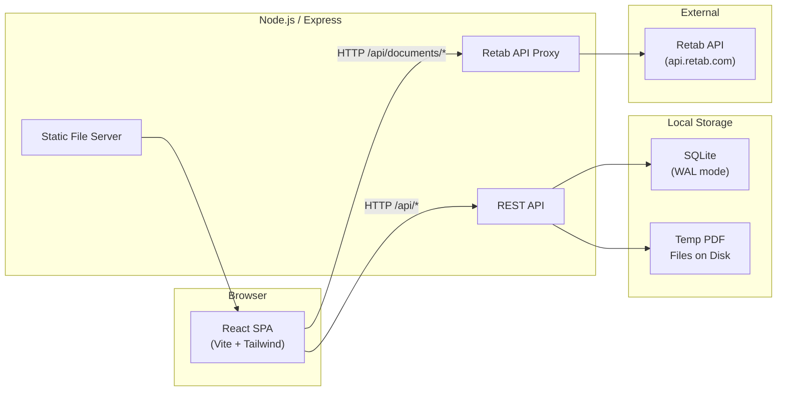
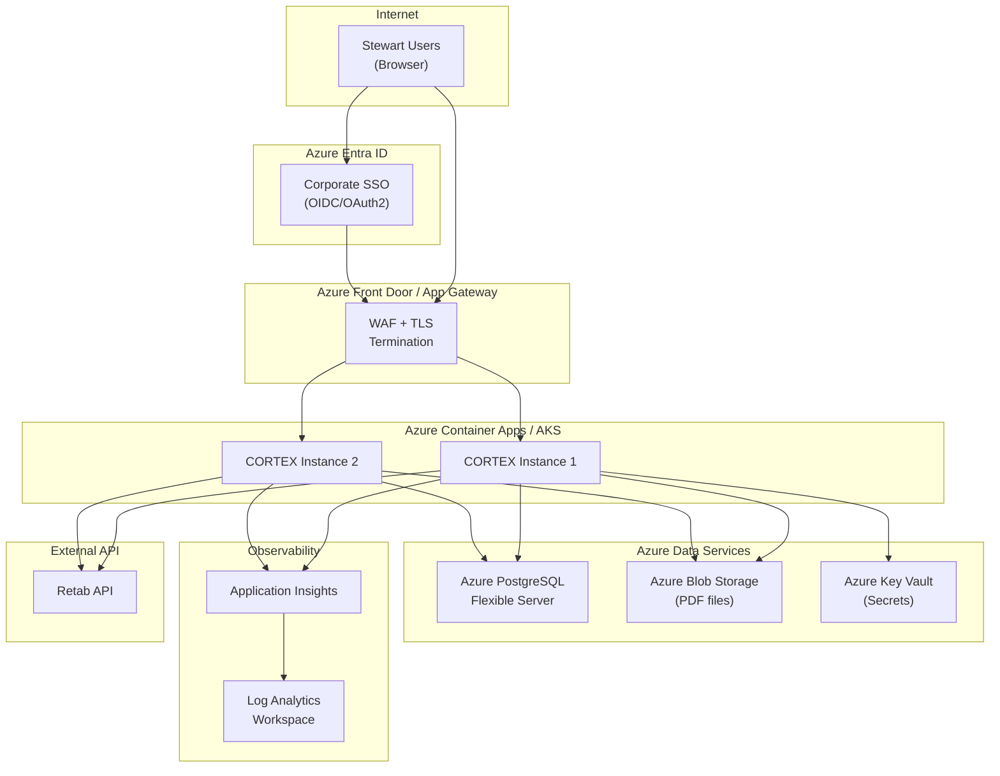

# Azure Enterprise Architecture Review -- CORTEX (SAIL-IDP)

## Current Architecture Summary

CORTEX is an intelligent document processing app for Stewart Title. It ingests real estate PDF packets, splits/classifies/extracts structured data via the Retab API, routes low-confidence results to human review, and exports to title production systems (SoftPro, RamQuest, Qualia, etc.).

**Current tech stack:** React 19 + Vite 7 frontend, Express 5 backend, SQLite (better-sqlite3), Retab API for AI document processing. Single Docker container deployment.

---

## Enterprise Gaps (Critical to Address)

### 1. No Authentication or Authorization

**Current state:** All API endpoints are completely open. No login, no JWT, no OAuth, no RBAC. The admin "clear database" endpoint uses a hardcoded password (`"stewart"`) in [server.js](server.js) line 727.

**Risk:** Any network-adjacent user can access all data, delete the database, or use the Retab API proxy (consuming credits).

**Recommendation:** Integrate with **Azure Entra ID (formerly Azure AD)** using MSAL.js on the frontend and `passport-azure-ad` or a similar middleware on the backend. This gives SSO with existing Stewart corporate accounts, RBAC for admin vs. operator roles, and audit-ready identity.

### 2. SQLite is Not Enterprise-Grade for Multi-Instance Deployment

**Current state:** SQLite file at `DB_PATH/sail-idp.db`. WAL mode enabled, but SQLite is single-writer and tied to a single host filesystem.

**Risk:** Cannot scale horizontally (no multi-instance), no backup/HA story, no point-in-time recovery. A container restart without a persistent volume loses all data.

**Recommendation:** Migrate to **Azure Database for PostgreSQL -- Flexible Server** or **Azure SQL Database**. This provides HA, automated backups, geo-redundancy, scaling, and works across multiple app instances.

### 3. API Key Stored in Browser localStorage

**Current state:** The Retab API key is stored in `localStorage.retab_api_key` and passed via `Api-Key` header from the client through the proxy. Documented in [SECURITY.md](SECURITY.md).

**Risk:** XSS vulnerability exposes the API key. Any JavaScript on the page can read localStorage. The key transits through the network on every request.

**Recommendation:** Store the API key server-side as an **Azure Key Vault** secret. The backend retrieves it at startup (or on-demand via Managed Identity) and injects it into outbound Retab API calls. The key never reaches the browser.

### 4. No Centralized Logging or Observability

**Current state:** `console.log` for request logging. Docker json-file driver with 10MB rotation. No structured logging, no metrics, no tracing.

**Risk:** No audit trail, no alerting, no performance visibility. Unacceptable for enterprise compliance.

**Recommendation:** Integrate **Azure Application Insights** (via the Node.js SDK). This provides structured logging, distributed tracing, request metrics, dependency tracking (Retab API calls), and alerts. Add `winston` or `pino` as a structured logger.

### 5. No TLS Termination or Reverse Proxy

**Current state:** Express serves directly on port 3005. SECURITY.md mentions "use HTTPS in front of the server" but nothing is configured.

**Recommendation:** Deploy behind **Azure Application Gateway** or **Azure Front Door** for TLS termination, WAF (Web Application Firewall), and DDoS protection. Alternatively, use an ingress controller if deploying to AKS.

### 6. Temp File Storage on Local Disk

**Current state:** Uploaded PDFs stored in `data/temp-pdfs/` on the container filesystem with a 14-day TTL cleanup.

**Risk:** Files lost on container restart (unless volume-mounted). Not shared across instances. No encryption at rest.

**Recommendation:** Use **Azure Blob Storage** for uploaded PDFs. Provides encryption at rest, lifecycle policies for automatic cleanup, access via Managed Identity, and works across multiple app instances.

### 7. No CI/CD or Infrastructure-as-Code

**Current state:** Manual `docker-compose up` deployment. No pipeline, no IaC, no environment promotion.

**Recommendation:** Use **Azure DevOps Pipelines** or **GitHub Actions** for CI/CD. Define infrastructure with **Bicep** or **Terraform**. Push container images to **Azure Container Registry (ACR)**.

### 8. CORS Configured as Wildcard

**Current state:** `CORS_ORIGIN=*` in [.env.docker](.env.docker) (line appears twice, second value `https://cortex.stewart.com` overrides). Same duplication in the [Dockerfile](Dockerfile) lines 52-53.

**Risk:** Misconfiguration could leave CORS wide open. The duplicate `CORS_ORIGIN` lines in both files are a latent bug.

**Recommendation:** Fix the duplicate lines. Lock CORS to the exact production origin (`https://cortex.stewart.com`) and use environment-specific configuration for dev/staging.

### 9. No Content Security Policy

**Current state:** CSP is explicitly disabled in [server.js](server.js) line 153 (`contentSecurityPolicy: false`) to support the SPA and Mermaid diagrams.

**Recommendation:** Define a permissive-but-real CSP that allows `self`, inline scripts for the SPA, and the specific CDN origins needed. This mitigates XSS even with the SPA architecture.

### 10. No Health/Readiness Probes Beyond Basic

**Current state:** `GET /health` returns 200. No readiness check (e.g., DB connectivity), no liveness probe that verifies downstream dependencies.

**Recommendation:** Add `/health/ready` (checks DB + Retab API reachability) and `/health/live` (lightweight liveness) for proper Kubernetes/Azure Container Apps orchestration.

---

## Recommended Azure Target Architecture

**Compute options (pick one):**

- **Azure Container Apps** (recommended for simplicity) -- serverless containers, built-in scaling, Dapr integration, managed ingress with TLS
- **Azure Kubernetes Service (AKS)** -- if Stewart already has a K8s footprint and needs more control

**Networking:**

- Deploy into an **Azure VNet** with private endpoints for PostgreSQL, Blob Storage, and Key Vault
- Outbound traffic to Retab API via a NAT Gateway with a static IP (for allowlisting)
- No public endpoints for data services

---

## Phased Implementation Plan

### Phase 1: Security Foundations (Critical)

- Integrate Azure Entra ID authentication (MSAL.js frontend + passport middleware backend)
- Move Retab API key to Azure Key Vault; backend injects it via Managed Identity
- Remove hardcoded admin password; gate admin endpoints behind Entra ID roles
- Fix duplicate `CORS_ORIGIN` lines in Dockerfile and .env.docker
- Add a basic CSP policy

### Phase 2: Data Layer Migration

- Replace SQLite with Azure Database for PostgreSQL Flexible Server
- Refactor [db/database.js](db/database.js) to use `pg` (node-postgres) with connection pooling
- Migrate temp PDF storage to Azure Blob Storage with SAS tokens or Managed Identity
- Add database migration tooling (e.g., `node-pg-migrate` or Prisma)

### Phase 3: Observability and Operations

- Integrate Azure Application Insights SDK (`applicationinsights` npm package)
- Replace `console.log` with structured logger (pino or winston) wired to App Insights
- Add `/health/ready` and `/health/live` endpoints
- Set up Azure Monitor alerts for error rates, latency, and Retab API failures
- Add request correlation IDs for distributed tracing

### Phase 4: Infrastructure and CI/CD

- Create Bicep/Terraform templates for all Azure resources
- Set up Azure Container Registry for Docker image storage
- Build CI/CD pipeline (Azure DevOps or GitHub Actions): lint, test, build, push image, deploy to staging, promote to production
- Configure environment-specific settings (dev/staging/prod) via Azure App Configuration

### Phase 5: Hardening and Scale

- Deploy to Azure Container Apps (or AKS) with auto-scaling rules
- Place Azure Front Door or Application Gateway in front for WAF + TLS
- Enable Azure DDoS Protection
- Set up Azure Backup for PostgreSQL
- Conduct penetration testing and security review
- Document disaster recovery and RTO/RPO targets

