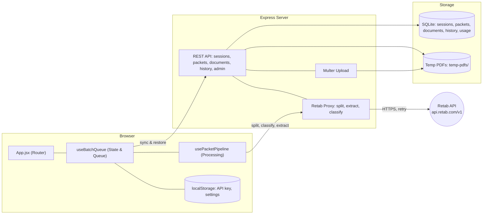
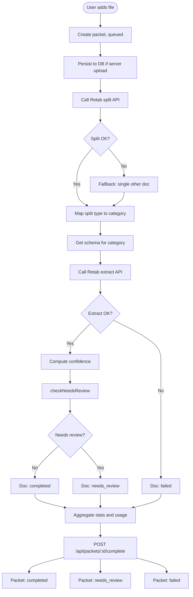
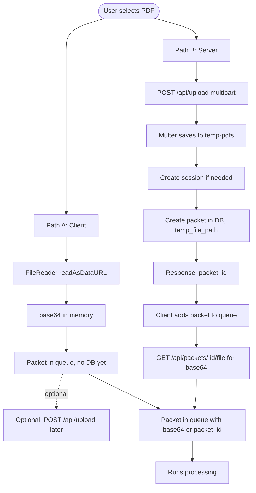
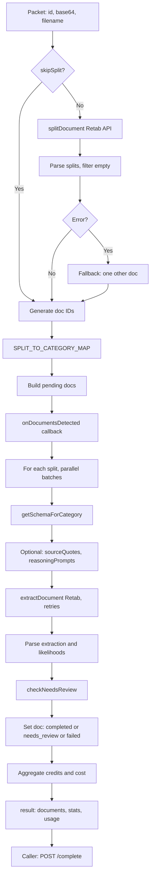
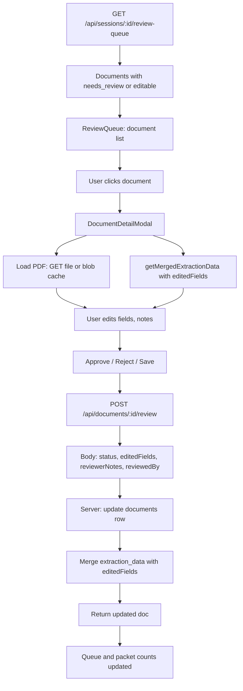
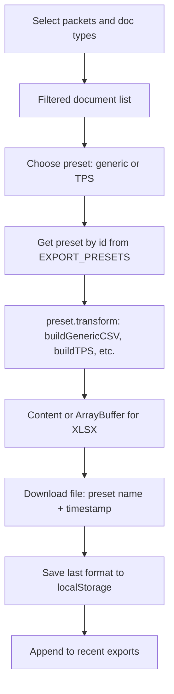
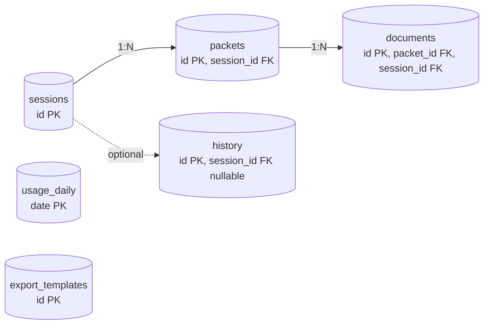
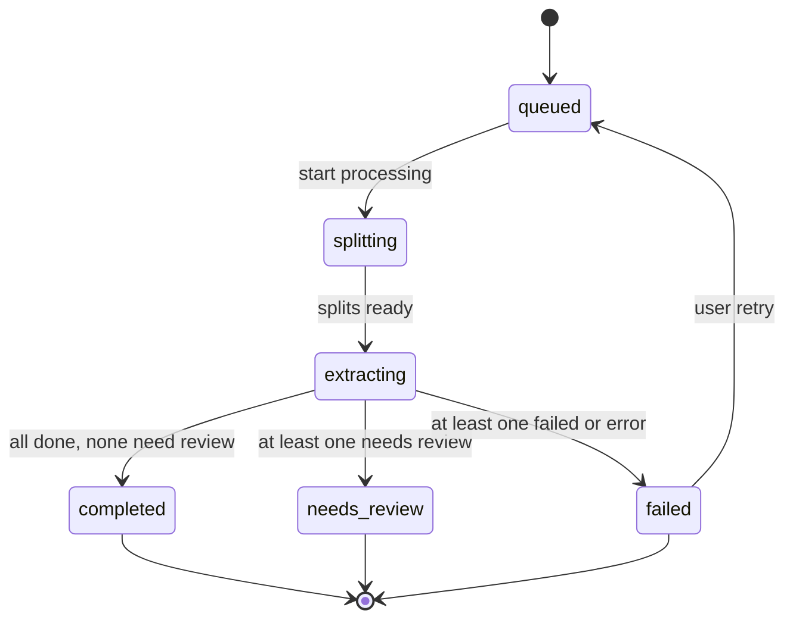
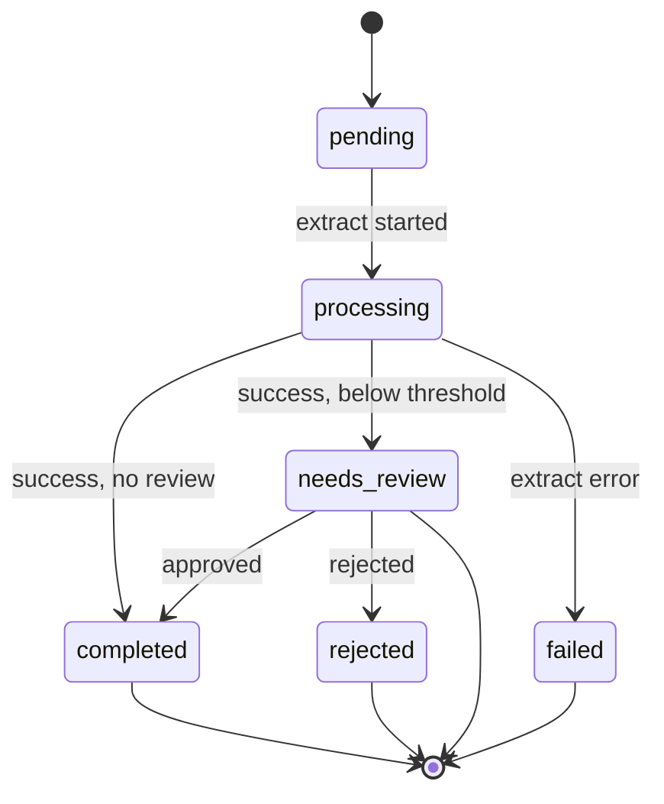
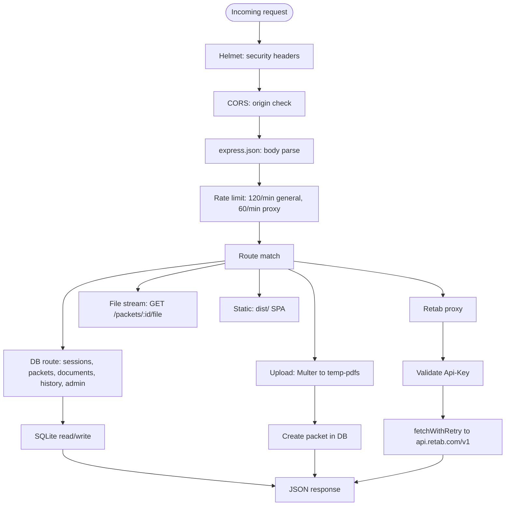

# CORTEX Architecture Documentation

## Table of Contents

1. [System Overview](#system-overview)
2. [Technology Stack](#technology-stack)
3. [Architecture Diagram](#architecture-diagram)
4. [Detailed Mermaid flowcharts](#detailed-mermaid-flowcharts)
5. [Document Processing Pipeline](#document-processing-pipeline)
6. [Database Schema](#database-schema)
7. [REST API Reference](#rest-api-reference)
8. [State Machines](#state-machines)
9. [Configuration](#configuration)
10. [Security](#security)
11. [Deployment](#deployment)

---

## System Overview

CORTEX is a document processing application designed for Stewart Title's title insurance operations. It processes multi-document PDF packets, extracts structured data using the Retab API, and provides human review workflows for quality assurance.

### Key Components

| Component | Technology | Purpose |
|-----------|------------|---------|
| Frontend | React 18 + Vite | Single-page application with document upload, processing views, and admin dashboard |
| Backend | Node.js + Express | REST API server, Retab API proxy, and database management |
| Database | SQLite (WAL mode) | Persistent storage for sessions, packets, documents, history, and usage metrics |
| External API | Retab | Document splitting, classification, and extraction |

### Core Capabilities

- **Batch Processing**: Upload and process multiple PDF packets concurrently
- **Document Splitting**: Automatically detect and separate individual documents within PDFs
- **Data Extraction**: Extract structured fields using category-specific JSON schemas
- **Confidence Scoring**: Per-field likelihood scores for extraction quality assessment
- **Human Review**: Flag low-confidence extractions for manual verification
- **Export**: JSON, CSV, and human-readable summary exports
- **Usage Tracking**: Credit, cost, and API call metrics

---

## Technology Stack

### Frontend

```
React 18.2         - UI framework
Vite 5.0           - Build tool and dev server
Tailwind CSS 4.0   - Utility-first CSS
Lucide React       - Icon library
Mermaid            - Diagram rendering
```

### Backend

```
Node.js 18+        - Runtime
Express 4.18       - Web framework
better-sqlite3     - SQLite driver (synchronous)
Multer             - File upload handling
Helmet             - Security headers
express-rate-limit - Rate limiting
```

### External Services

```
Retab API          - https://api.retab.com/v1
  - Document splitting
  - Document classification
  - Structured extraction
  - Schema generation
```

---

## Architecture Diagram

```
┌─────────────────────────────────────────────────────────────────────────────┐
│                              Browser (React SPA)                             │
│  ┌─────────────┐  ┌─────────────┐  ┌─────────────┐  ┌─────────────────────┐ │
│  │  App.jsx    │  │  useBatch   │  │ usePipeline │  │    localStorage     │ │
│  │  (Router)   │──│  Queue.js   │──│    .js      │──│  - API key          │ │
│  │             │  │  (State)    │  │ (Processing)│  │  - Session state    │ │
│  └─────────────┘  └─────────────┘  └─────────────┘  │  - History          │ │
│         │                │                │         │  - Settings         │ │
│         └────────────────┼────────────────┘         └─────────────────────┘ │
└─────────────────────────────┼───────────────────────────────────────────────┘
                              │ HTTP (localhost:3005)
┌─────────────────────────────┼───────────────────────────────────────────────┐
│                     Node.js Express Server                                   │
│  ┌─────────────┐  ┌────────┴────────┐  ┌─────────────────────────────────┐  │
│  │  Security   │  │   REST API      │  │      Retab API Proxy            │  │
│  │  Middleware │──│   /api/*        │  │      /api/documents/*           │  │
│  │  - Helmet   │  │                 │  │      /api/schemas/*             │  │
│  │  - CORS     │  │  Sessions       │  │      /api/jobs/*                │  │
│  │  - Rate     │  │  Packets        │  │                                 │  │
│  │    Limit    │  │  Documents      │  │  Forwards to api.retab.com/v1   │  │
│  └─────────────┘  │  History        │  │  with Api-Key header            │  │
│                   │  Admin          │  └─────────────────────────────────┘  │
│                   └────────┬────────┘              │                        │
└────────────────────────────┼───────────────────────┼────────────────────────┘
                             │                       │
              ┌──────────────┴──────────┐            │
              │                         │            │
        ┌─────┴─────┐           ┌───────┴──────┐     │
        │  SQLite   │           │  Temp PDFs   │     │
        │  Database │           │  ./data/     │     │
        │           │           │  temp-pdfs/  │     │
        │ - sessions│           │              │     │
        │ - packets │           │ (14-day TTL) │     │
        │ - docs    │           └──────────────┘     │
        │ - history │                                │
        │ - usage   │                                │
        └───────────┘                                │
                                                     │ HTTPS
                                          ┌──────────┴──────────┐
                                          │    Retab API        │
                                          │ api.retab.com/v1    │
                                          │                     │
                                          │ - /documents/split  │
                                          │ - /documents/extract│
                                          │ - /schemas/generate │
                                          └─────────────────────┘
```

---

## Detailed Mermaid flowcharts

The following Mermaid diagrams provide technical detail for CORTEX subsystems. They reference `App.jsx`, `useBatchQueue.js`, `usePacketPipeline.js`, `server.js`, `db/database.js`, and `exportPresets.js`.

### System architecture (high-level)

Browser (React SPA), Express server, storage (SQLite + temp PDFs), and Retab API with main data flows. Pipeline calls the Retab proxy for split/classify/extract; BatchQueue syncs and restores via REST; uploads write to temp-pdfs.



### End-to-end document processing pipeline

Single packet from user adding a file to final state (completed, needs_review, or failed). Includes split API, per-document extract with schema and checkNeedsReview, aggregation, and POST /api/packets/:id/complete.



### Upload flow (client and server paths)

Two paths: client-side base64 (no DB until /complete) or server upload (POST /api/upload, temp file, packet in DB). Convergence: packet in queue with base64 or packet_id; server-stored packets get base64 via GET /api/packets/:id/file when processing runs.



### Single-packet processing (split to extract)

Detail inside processPacket: split phase (splitDocument Retab call, filter empty, fallback to other), then doc placeholders, then extract phase in parallel batches (schema, annotate, extractDocument with retries, checkNeedsReview). Output: result with documents, stats, usage; caller syncs via /complete.



### Review workflow

From GET /api/sessions/:id/review-queue to opening a document in DocumentDetailModal (PDF via GET file or cache, getMergedExtractionData), user edits and Approve/Reject/Save, POST /api/documents/:id/review, server updates documents row and returns; UI updates queue and packet counts.



### Export flow

Select scope (packets and doc types), choose preset (generic or TPS), execute preset.transform(packets), download file, save last format and recent exports to localStorage.



### Database entity relationship

Tables: sessions (PK id), packets (PK id, FK session_id), documents (PK id, FK packet_id, FK session_id). Cardinality 1:N. Additional tables: history (session_id nullable), usage_daily (date PK), export_templates (PK id).



### Packet state machine

Packet status transitions: queued to splitting to extracting; from extracting to completed, needs_review, or failed. Optional retry from failed back to queued.



### Document state machine

Document status: pending (after split) to processing (extract in progress) to completed, needs_review, or failed. From needs_review, human action to completed (approved) or rejected.



### API request lifecycle (server)

Incoming request through Helmet, CORS, express.json, rate limit (general vs proxy), then route: DB read/write, upload (Multer to temp-pdfs), or Retab proxy (Api-Key, fetchWithRetry to api.retab.com/v1). Response: JSON or file stream; static dist for SPA.



---

## Document Processing Pipeline

### Pipeline Stages

```
 ┌─────────┐    ┌─────────┐    ┌───────────┐    ┌─────────┐    ┌────────┐
 │ UPLOAD  │───▶│  SPLIT  │───▶│  EXTRACT  │───▶│ REVIEW  │───▶│ EXPORT │
 └─────────┘    └─────────┘    └───────────┘    └─────────┘    └────────┘
      │              │               │               │              │
      ▼              ▼               ▼               ▼              ▼
  PDF files     Subdocument     Per-document    Flag low        JSON/CSV
  to base64     detection       extraction      confidence      download
```

### Stage Details

#### 1. Upload
- Files selected via drag-and-drop or file picker
- PDFs converted to base64 for client-side processing
- Optional: Upload to server for persistence (`POST /api/upload`)
- Packet created with status `queued`

#### 2. Split
- Retab API call: `POST /v1/documents/split`
- Detects 30+ document types (deeds, mortgages, liens, etc.)
- Returns page ranges for each subdocument
- Falls back to single "other" document on failure

#### 3. Extract
- Parallel batch processing (5 documents per batch)
- Category-specific JSON schemas
- Retab API call: `POST /v1/documents/extract`
- Returns extracted fields + per-field confidence scores
- Supports consensus mode (multiple extractions averaged)

#### 4. Review
- Automatic flagging based on:
  - Overall confidence < 75%
  - Individual fields < 50%
  - Missing critical fields
  - Unrecognized document types
- Human reviewer can approve/reject/edit

#### 5. Export
- JSON: Full structured data with audit trail
- CSV: Flattened rows for spreadsheet import
- Summary: Human-readable text report

### Supported Document Types

| Category | Split Types |
|----------|-------------|
| **Deeds** | deed, warranty_deed, quitclaim_deed, special_warranty_deed |
| **Mortgages** | mortgage, deed_of_trust, mortgage_modification |
| **Liens** | tax_lien, mechanics_lien, hoa_lien, judgment_lien |
| **Legal** | easement, covenant, power_of_attorney, affidavit |
| **Tax** | tax_document, tax_certificate |
| **Other** | survey, plat, ucc_filing, title_commitment, cover_sheet |

---

## Database Schema

### Entity Relationship

```
┌─────────────┐       ┌─────────────┐       ┌─────────────┐
│  sessions   │──────<│   packets   │──────<│  documents  │
└─────────────┘       └─────────────┘       └─────────────┘
       │                     │
       │              ┌──────┴──────┐
       │              │             │
       ▼              ▼             ▼
┌─────────────┐ ┌───────────┐ ┌──────────────┐
│   history   │ │usage_daily│ │export_templ. │
└─────────────┘ └───────────┘ └──────────────┘
```

### Table: `sessions`

Tracks processing batches/sessions.

| Column | Type | Default | Description |
|--------|------|---------|-------------|
| `id` | TEXT | PRIMARY KEY | Unique session ID |
| `created_at` | DATETIME | CURRENT_TIMESTAMP | Creation time |
| `updated_at` | DATETIME | CURRENT_TIMESTAMP | Last update time |
| `status` | TEXT | 'active' | Session status (active/completed) |
| `total_packets` | INTEGER | 0 | Number of packets in session |
| `completed_packets` | INTEGER | 0 | Packets completed successfully |
| `failed_packets` | INTEGER | 0 | Packets that failed |
| `needs_review_packets` | INTEGER | 0 | Packets needing review |
| `total_credits` | REAL | 0 | Total Retab credits used |
| `total_cost` | REAL | 0 | Total cost in USD |
| `total_pages` | INTEGER | 0 | Total pages processed |
| `api_calls` | INTEGER | 0 | Number of API calls made |

### Table: `packets`

Document packets being processed.

| Column | Type | Default | Description |
|--------|------|---------|-------------|
| `id` | TEXT | PRIMARY KEY | Unique packet ID |
| `session_id` | TEXT | NOT NULL | FK → sessions.id (CASCADE) |
| `filename` | TEXT | NOT NULL | Original filename |
| `status` | TEXT | 'queued' | Processing status |
| `created_at` | DATETIME | CURRENT_TIMESTAMP | Creation time |
| `started_at` | DATETIME | NULL | Processing start time |
| `completed_at` | DATETIME | NULL | Processing end time |
| `retry_count` | INTEGER | 0 | Number of retry attempts |
| `error` | TEXT | NULL | Error message if failed |
| `total_documents` | INTEGER | 0 | Documents in packet |
| `completed_documents` | INTEGER | 0 | Documents completed |
| `needs_review_documents` | INTEGER | 0 | Documents needing review |
| `failed_documents` | INTEGER | 0 | Documents that failed |
| `total_credits` | REAL | 0 | Credits used |
| `total_cost` | REAL | 0 | Cost in USD |
| `temp_file_path` | TEXT | NULL | Path to temp PDF file |

**Indexes:**
- `idx_packets_session` on `session_id`
- `idx_packets_status` on `status`

### Table: `documents`

Individual documents extracted from packets.

| Column | Type | Default | Description |
|--------|------|---------|-------------|
| `id` | TEXT | PRIMARY KEY | Unique document ID |
| `packet_id` | TEXT | NOT NULL | FK → packets.id (CASCADE) |
| `session_id` | TEXT | NOT NULL | FK → sessions.id (CASCADE) |
| `document_type` | TEXT | NULL | Document category |
| `display_name` | TEXT | NULL | Human-readable name |
| `status` | TEXT | 'pending' | Processing status |
| `pages` | TEXT | NULL | JSON array of page numbers |
| `extraction_data` | TEXT | NULL | JSON extraction result |
| `likelihoods` | TEXT | NULL | JSON field likelihoods |
| `extraction_confidence` | REAL | NULL | Average confidence (0-1) |
| `needs_review` | INTEGER | 0 | Review flag (0/1) |
| `review_reasons` | TEXT | NULL | JSON array of reasons |
| `reviewed_at` | DATETIME | NULL | Review timestamp |
| `reviewed_by` | TEXT | NULL | Reviewer identifier |
| `reviewer_notes` | TEXT | NULL | Review notes |
| `edited_fields` | TEXT | NULL | JSON of edited values |
| `credits_used` | REAL | 0 | Credits for this doc |
| `created_at` | DATETIME | CURRENT_TIMESTAMP | Creation time |
| `updated_at` | DATETIME | CURRENT_TIMESTAMP | Last update |

**Indexes:**
- `idx_documents_packet` on `packet_id`
- `idx_documents_session` on `session_id`
- `idx_documents_needs_review` on `needs_review`

### Table: `history`

Processing history entries.

| Column | Type | Default | Description |
|--------|------|---------|-------------|
| `id` | TEXT | PRIMARY KEY | Unique history ID |
| `session_id` | TEXT | NULL | FK → sessions.id (SET NULL) |
| `completed_at` | DATETIME | CURRENT_TIMESTAMP | Completion time |
| `total_packets` | INTEGER | NULL | Packets processed |
| `total_documents` | INTEGER | NULL | Documents processed |
| `completed` | INTEGER | NULL | Successful documents |
| `needs_review` | INTEGER | NULL | Documents needing review |
| `failed` | INTEGER | NULL | Failed documents |
| `total_credits` | REAL | NULL | Credits used |
| `total_cost` | REAL | NULL | Cost in USD |
| `summary` | TEXT | NULL | JSON summary data |

**Indexes:**
- `idx_history_completed` on `completed_at`

### Table: `usage_daily`

Daily usage aggregates.

| Column | Type | Default | Description |
|--------|------|---------|-------------|
| `date` | TEXT | PRIMARY KEY | Date (YYYY-MM-DD) |
| `total_credits` | REAL | 0 | Credits used |
| `total_cost` | REAL | 0 | Cost in USD |
| `total_pages` | INTEGER | 0 | Pages processed |
| `api_calls` | INTEGER | 0 | API calls made |
| `packets_processed` | INTEGER | 0 | Packets completed |
| `documents_processed` | INTEGER | 0 | Documents completed |

### Table: `export_templates`

Saved export configurations.

| Column | Type | Default | Description |
|--------|------|---------|-------------|
| `id` | TEXT | PRIMARY KEY | Unique template ID |
| `name` | TEXT | NOT NULL UNIQUE | Template name |
| `config` | TEXT | NOT NULL | JSON configuration |
| `created_at` | DATETIME | CURRENT_TIMESTAMP | Creation time |
| `updated_at` | DATETIME | CURRENT_TIMESTAMP | Last update |

---

## REST API Reference

### Base URL

```
Development: http://localhost:3005
Production:  https://your-domain.com
```

### Authentication

- **Internal endpoints**: No authentication required
- **Retab proxy endpoints**: Require `Api-Key` header
- **Admin endpoints**: Require password in request body

### Response Format

All responses are JSON:

```json
// Success
{ "data": {...}, "success": true }

// Error
{ "error": "Error message", "success": false }
```

---

### Health & Status

#### `GET /health`
Health check endpoint.

**Response:** `200 OK`
```json
{ "status": "ok" }
```

#### `GET /api/status`
System status with database stats.

**Response:** `200 OK`
```json
{
  "server": "online",
  "database": "connected",
  "version": "0.2.0",
  "stats": {
    "sessions": 5,
    "packets": 23,
    "documents": 156,
    "usage": { "credits": 45.2, "cost": 0.45 }
  }
}
```

---

### Sessions

#### `GET /api/sessions/active`
Get or create active session.

**Response:** `200 OK`
```json
{
  "id": "sess_1234567890_abc",
  "status": "active",
  "total_packets": 3,
  "completed_packets": 2,
  ...
}
```

#### `POST /api/sessions`
Create new session.

**Request Body:**
```json
{ "id": "optional-custom-id" }
```

**Response:** `201 Created`

#### `GET /api/sessions/:id`
Get session by ID.

#### `PATCH /api/sessions/:id`
Update session.

**Request Body:** Partial session object

#### `POST /api/sessions/:id/close`
Close session (sets status to 'completed').

#### `GET /api/sessions/:id/full`
Get full session with packets and documents.

---

### Packets

#### `POST /api/packets`
Create packet(s).

**Request Body:**
```json
{
  "session_id": "sess_123",
  "packets": [
    { "id": "pkt_1", "filename": "doc.pdf" }
  ]
}
```

#### `GET /api/packets/:id`
Get packet by ID.

#### `GET /api/sessions/:sessionId/packets`
Get all packets for a session.

#### `PATCH /api/packets/:id`
Update packet.

#### `POST /api/packets/:id/complete`
Mark packet as complete with results.

**Request Body:**
```json
{
  "status": "completed",
  "documents": [...],
  "usage": { "credits": 1.5, "cost": 0.015 }
}
```

#### `DELETE /api/packets/:id`
Delete packet (updates session counts).

#### `POST /api/upload`
Upload PDF file.

**Content-Type:** `multipart/form-data`

| Field | Type | Required | Description |
|-------|------|----------|-------------|
| `file` | File | Yes | PDF file (max 100MB) |
| `session_id` | String | Yes | Session ID |

**Response:**
```json
{
  "packet_id": "pkt_123",
  "filename": "document.pdf",
  "temp_file_path": "./data/temp-pdfs/pkt_123.pdf"
}
```

#### `GET /api/packets/:id/file`
Get stored PDF file for a packet.

**Response:** PDF file stream

---

### Documents

#### `POST /api/documents`
Create document(s).

**Request Body:**
```json
{
  "documents": [
    {
      "id": "doc_1",
      "packet_id": "pkt_123",
      "session_id": "sess_123",
      "document_type": "deed",
      "pages": [1, 2, 3],
      "extraction_data": {...}
    }
  ]
}
```

#### `GET /api/documents/:id`
Get document by ID.

#### `GET /api/packets/:packetId/documents`
Get all documents for a packet.

#### `GET /api/sessions/:sessionId/review-queue`
Get documents needing review in a session.

#### `POST /api/documents/:id/review`
Submit document review.

**Request Body:**
```json
{
  "status": "completed",
  "reviewerNotes": "Verified grantor name",
  "editedFields": {
    "grantor_name": "Corrected Name"
  },
  "reviewedBy": "user@example.com"
}
```

---

### History

#### `GET /api/history`
Get processing history.

**Query Parameters:**
- `limit` (default: 50) - Max entries to return

#### `POST /api/history`
Create history entry.

#### `DELETE /api/history/:id`
Delete history entry.

#### `DELETE /api/history`
Clear all history.

---

### Admin

#### `GET /api/admin/metrics`
Get admin dashboard metrics.

**Response:**
```json
{
  "totalDocuments": 156,
  "totalPages": 482,
  "totalCost": 4.82,
  "confidenceDistribution": [0.85, 0.92, 0.78, ...],
  "fieldStats": [...],
  "processingTimes": [...]
}
```

#### `POST /api/admin/clear-database`
Reset application (clear all data).

**Request Body:**
```json
{ "password": "stewart" }
```

**Response:** `200 OK` or `403 Forbidden`

---

### Export Templates

#### `GET /api/export-templates`
Get all export templates.

#### `POST /api/export-templates`
Save export template.

#### `DELETE /api/export-templates/:name`
Delete export template.

---

### Usage & Statistics

#### `GET /api/usage`
Get usage statistics.

**Query Parameters:**
- `days` (default: 30) - Days of history

#### `GET /api/stats/30d`
Get 30-day aggregated statistics.

**Query Parameters:**
- `days` (default: 30)

**Response:**
```json
{
  "totalPages": 1234,
  "packetsProcessed": 45,
  "documentsProcessed": 312,
  "totalCost": 12.34,
  "avgConfidence": 0.87,
  "reviewRate": 0.15,
  "avgProcessingDuration": 2340
}
```

---

### Retab API Proxy

All Retab proxy endpoints require `Api-Key` header.

#### `POST /api/documents/split`
Split PDF into subdocuments.

**Headers:** `Api-Key: your-retab-api-key`

**Request Body:**
```json
{
  "document": {
    "filename": "packet.pdf",
    "url": "data:application/pdf;base64,..."
  },
  "subdocuments": ["deed", "mortgage", "tax_document", ...],
  "model": "retab-small",
  "image_resolution_dpi": 192
}
```

#### `POST /api/documents/extract`
Extract structured data from document.

**Request Body:**
```json
{
  "document": {
    "filename": "deed.pdf",
    "url": "data:application/pdf;base64,..."
  },
  "json_schema": {...},
  "model": "retab-small",
  "n_consensus": 1,
  "temperature": 0,
  "image_resolution_dpi": 192
}
```

#### `POST /api/documents/classify`
Classify document type.

#### `POST /api/documents/parse`
Parse document to markdown.

#### `POST /api/schemas/generate`
Generate JSON schema from description.

#### `POST /api/jobs`
Create async extraction job.

#### `GET /api/jobs/:jobId`
Get job status.

---

### Debug Endpoints

**Note:** Disabled in production (`NODE_ENV=production`).

#### `GET /api/debug/status`
Debug status with environment info.

#### `GET /api/debug/errors`
Get recent failed packets.

**Query Parameters:**
- `limit` (default: 100)

---

## State Machines

### Packet Status

```
         ┌──────────────────────────────────────┐
         │                                      │
         ▼                                      │
     ┌────────┐     ┌───────────┐     ┌─────────┴───┐
     │ QUEUED │────▶│ SPLITTING │────▶│ EXTRACTING  │
     └────────┘     └───────────┘     └──────┬──────┘
                                             │
                    ┌────────────────────────┼────────────────────────┐
                    │                        │                        │
                    ▼                        ▼                        ▼
             ┌───────────┐          ┌──────────────┐          ┌────────┐
             │ COMPLETED │          │ NEEDS_REVIEW │          │ FAILED │
             └───────────┘          └──────────────┘          └────────┘
```

### Document Status

```
     ┌────────────┐
     │ processing │
     └─────┬──────┘
           │
     ┌─────┼─────────────────┐
     │     │                 │
     ▼     ▼                 ▼
┌─────────┐ ┌──────────────┐ ┌────────┐
│completed│ │ needs_review │ │ failed │
└─────────┘ └──────┬───────┘ └────────┘
                   │
            ┌──────┴──────┐
            │             │
            ▼             ▼
       ┌─────────┐   ┌──────────┐
       │completed│   │ rejected │
       │(approved)│  │          │
       └─────────┘   └──────────┘
```

### Review Decision Criteria

| Condition | Threshold | Action |
|-----------|-----------|--------|
| Average confidence | < 75% | Flag for review |
| Individual field | < 50% | List specific fields |
| Missing critical field | N/A | Flag with field names |
| Document type | "other" | Flag as unrecognized |
| OCR issues | API flag | Flag for verification |

---

## Configuration

### Environment Variables

| Variable | Default | Description |
|----------|---------|-------------|
| `PORT` | `3005` | Server port |
| `NODE_ENV` | `development` | Environment (development/production) |
| `DB_PATH` | `./data` | Directory for SQLite database |
| `CORS_ORIGIN` | `*` | Allowed CORS origins (comma-separated) |
| `VITE_API_URL` | `http://localhost:3005` | API base URL for frontend |

### localStorage Keys

| Key | Preserved on Reset | Description |
|-----|-------------------|-------------|
| `retab_api_key` | Yes | Retab API key |
| `cortex_dark_mode` | Yes | Dark mode preference |
| `stewart_ingestion_session` | No | Batch queue state |
| `stewart_processing_history` | No | Processing history |
| `export_templates` | No | Custom export templates |
| `sail_retab_settings` | No | Retab configuration |

### Retab Configuration Defaults

```javascript
{
  model: "retab-small",       // retab-micro, retab-small, retab-large
  nConsensus: 1,              // 1-5 (multiplies cost)
  imageDpi: 192,              // 96, 150, 192, 300
  temperature: 0,             // 0.0-1.0
  confidenceThreshold: 0.7    // Review threshold
}
```

### Model Pricing

| Model | Credits/Page | Best For |
|-------|--------------|----------|
| `retab-micro` | 0.5 | Simple documents, high volume |
| `retab-small` | 1.0 | Standard documents (default) |
| `retab-large` | 2.0 | Complex layouts, handwriting |

**Cost:** $0.01 per credit

---

## Security

### Middleware Stack

1. **Helmet.js**
   - `noSniff()` - Prevents MIME sniffing
   - `frameguard({ action: "sameorigin" })` - Clickjacking protection
   - `referrerPolicy({ policy: "strict-origin-when-cross-origin" })`
   - CSP disabled for SPA/Mermaid compatibility

2. **CORS**
   - Configurable via `CORS_ORIGIN` env var
   - Supports multiple origins (comma-separated)
   - `credentials: true` for cookie support
   - Warns if `*` used in production

3. **Rate Limiting**
   - General API: 120 req/min (prod) / 300 req/min (dev)
   - Proxy endpoints: 60 req/min (prod) / 120 req/min (dev)

4. **Request Validation**
   - JSON body limit: 100MB (for base64 documents)
   - File upload limit: 100MB
   - PDF-only file filter

### Authentication

| Endpoint Type | Authentication |
|---------------|----------------|
| Internal REST API | None |
| Retab proxy | `Api-Key` header (401 if missing) |
| Admin clear | Password in body (403 if invalid) |
| Debug endpoints | Disabled in production (404) |

### Data Security

- API key stored client-side only (never logged)
- No document data stored on Retab beyond request/response
- Temp PDF files auto-deleted after 14 days
- Parameterized SQL queries (SQLite)
- Database file permissions: owner-only

### Production Checklist

- [ ] Set `NODE_ENV=production`
- [ ] Configure specific `CORS_ORIGIN` (not `*`)
- [ ] Use HTTPS reverse proxy
- [ ] Secure database file location
- [ ] Change admin password
- [ ] Enable log aggregation
- [ ] Set up monitoring/alerting

---

## Deployment

### Docker

```bash
# Build image
docker build -t cortex .

# Run container
docker run -d \
  -p 3005:3005 \
  -v $(pwd)/data:/app/data \
  -e NODE_ENV=production \
  -e CORS_ORIGIN=https://your-domain.com \
  cortex
```

### Docker Compose

```yaml
version: '3.8'
services:
  cortex:
    build: .
    ports:
      - "3005:3005"
    volumes:
      - ./data:/app/data
    environment:
      - NODE_ENV=production
      - CORS_ORIGIN=https://your-domain.com
    restart: unless-stopped
```

### Manual Deployment

```bash
# Install dependencies
npm install

# Build frontend
npm run build

# Start production server
NODE_ENV=production node server.js
```

### File Structure (Production)

```
/app
├── dist/              # Built frontend (served statically)
├── data/
│   ├── sail-idp.db    # SQLite database
│   └── temp-pdfs/     # Temporary PDF storage
├── server.js          # Express server
├── db/
│   └── database.js    # Database module
└── node_modules/
```

### Health Monitoring

```bash
# Health check
curl http://localhost:3005/health

# Status with metrics
curl http://localhost:3005/api/status
```

---

## Appendix

### Error Codes

| Pattern | Cause | Remediation |
|---------|-------|-------------|
| `401 Unauthorized` | Missing/invalid API key | Check `Api-Key` header |
| `403 Forbidden` | Invalid admin password | Use correct password |
| `404 Not Found` | Resource not found | Check ID/path |
| `413 Payload Too Large` | File > 100MB | Reduce file size |
| `429 Too Many Requests` | Rate limit exceeded | Wait and retry |
| `500 Internal Server Error` | Server error | Check logs, retry |
| `502 Bad Gateway` | Retab API error | Retry with backoff |
| `ETIMEDOUT` | Request timeout | Increase timeout, retry |

### Support

- **Email:** philip.snowden@stewart.com
- **Subject:** SAIL Inquiry from CORTEX
